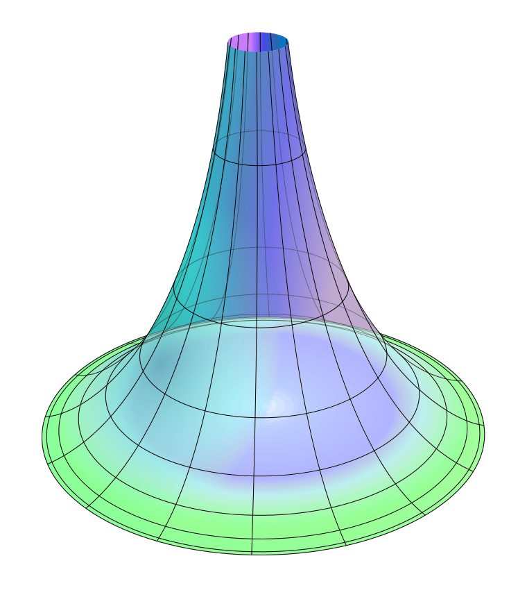

    

# Gravity

--- 

Pet project simulator for interactions between matter built off of OpenGL and C. 

Goals and features: 
- [x] Law of gravitation 
- [x] Object tracing
  - [x] Toggle object tracing
- [ ] Grid
  - [ ] Toggle Grid
- [x] Scaling up/down objects
- [x] Locking camera view to an object
- [ ] File format for importing scenes
- [ ] Collision 
- [ ] Soft-bodies and structures 

## Installation 

Gravity uses CMake as its build automation system. To download and run gravity, please follow these steps: 
- Clone the repository `git clone https://github.com/0xdeadbeer/gravity`
- Create a build directory `mkdir build`
- Go into the build directory `cd build`
- Generate build files `cmake ..`
- Compile project `make all`
- Run `./gravity`
- Enjoy

## Contributions 

We highly encourage playing around with the software and contributing to the project.
Before opening a pull request, the contributor is expected to open an issue in which they thoroughly describe the issue (or feature) they're solving (or implementing).

## License 

Gravity is licensed under the GPL-3.0 license. See the `LICENSE` file for more information.
